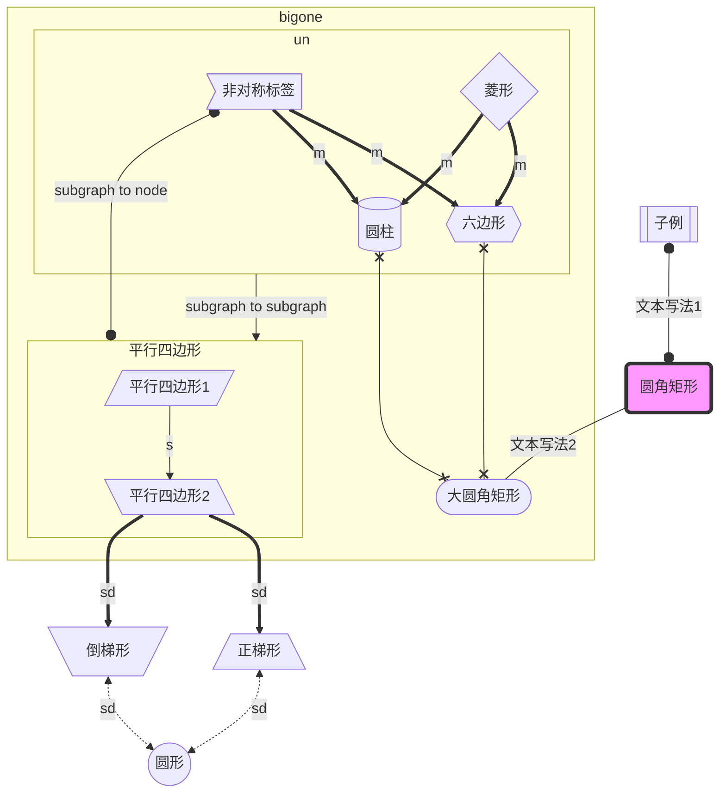

# Markdown使用范例

markdown支持html语法，所以很多样式其实都可以用内置style写法实现

## 文字修饰

`<u>`underline this, you can ctrl+u`</u>`

~~i want to delete this line~~

**bold this,you can ctrl + b**

*lean this line, you can ctrl + l*

`<span style='color:blue;background:pink;font-size:28px;font-family:幼圆;'>`html+内置style包围

 `<a href="#spch">`跳转：其他特殊字符`</a>`

<center>居中</center>

## 分割线（需要独占一行）

---

## Latex以及特殊字符

**可用\$...\$块内显示**

### 分段、分式函数

$$
c(u)=
\begin{cases} 
\sqrt{\frac{1}{N}\vdot c^2}，u=0 \\ 
\sqrt\frac{2}{N}，u\neq0
\end{cases}
$$

### 矩阵

$$
M=
\begin{bmatrix}
x_{11} & x_{12}  & \cdots   & x_{1m}   \\
x_{21} & x_{22}  & \cdots   & x_{2m}  \\
\vdots & \vdots  & \ddots   & \vdots  \\
x_{n1} & x_{n2}  & \cdots\  & x_{nm}  \\
\end{bmatrix}
$$

### 分栏

$$
\begin{aligned}
f_Y(y) & = f_X[h(y)]|h'(y)| \\[2ex]
& = f_X[h(y)]h'(y) \\[2ex]
& = \frac{1}{\theta}e^{-\frac{x}{\theta}}[\frac{dx}{dy}(-\frac{\theta}{ln(1-y)})] \\[2ex]
& = \frac{1}{\theta}e^{-\frac{-\frac{\theta}{ln(1-y)}}{\theta}}\frac{\theta}{1-y} \\[2ex]
& = \frac{1}{\theta}e^{ln(1-y)}\frac{\theta}{1-y} \\[2ex]
& = \frac{1-y}{\theta}\frac{\theta}{1-y} \\[2ex]
& = 1
\end{aligned}
$$

### 指数、对数

$$
e^{\log_{e+5}{5+e^2}}
$$

### 极限、求和、累积

$$
\lim_{n\rightarrow+\infty}\int_{-\infin}^{+\infin}{f(x)}=\frac{\sqrt{13}} {2\cdot3^x}
\\
\sum_{n=1}^{100}{a_n}
\\
\prod_{n=1}^{99}{x_n}
$$

### 向量

$$
3\vec{a}
$$

### 希腊字母

| 大写          | Markdown | 小写                 | Markdown    |
| ------------- | -------- | -------------------- | ----------- |
| A A*A*      | A        | α \alpha*α*      | \alpha      |
| B B*B*      | B        | β \beta*β*       | \beta       |
| Γ \GammaΓ   | \Gamma   | γ \gamma*γ*      | \gamma      |
| Δ \DeltaΔ   | \Delta   | δ \delta*δ*      | \delta      |
| E E*E*      | E        | ϵ \epsilon*ϵ*    | \epsilon    |
|               |          | ε \varepsilon*ε* | \varepsilon |
| Z Z*Z*      | Z        | ζ \zeta*ζ*       | \zeta       |
| H H*H*      | H        | η \eta*η*        | \eta        |
| Θ \ThetaΘ   | \Theta   | θ \theta*θ*      | \theta      |
| I I*I*      | I        | ι \iota*ι*       | \iota       |
| K K*K*      | K        | κ \kappa*κ*      | \kappa      |
| Λ \LambdaΛ  | \Lambda  | λ \lambda*λ*     | \lambda     |
| M M*M*      | M        | μ \mu*μ*         | \mu         |
| N N*N*      | N        | ν \nu*ν*         | \nu         |
| Ξ \XiΞ      | \Xi      | ξ \xi*ξ*         | \xi         |
| O O*O*      | O        | ο \omicron*ο*    | \omicron    |
| Π \PiΠ      | \Pi      | π \pi*π*         | \pi         |
| P P*P*      | P        | ρ \rho*ρ*        | \rho        |
| Σ \SigmaΣ   | \Sigma   | σ \sigma*σ*      | \sigma      |
| T T*T*      | T        | τ \tau*τ*        | \tau        |
| Υ \UpsilonΥ | \Upsilon | υ \upsilon*υ*    | \upsilon    |
| Φ \PhiΦ     | \Phi     | ϕ \phi*ϕ*        | \phi        |
|               |          | φ \varphi*φ*     | \varphi     |
| X X*X*      | X        | χ \chi*χ*        | \chi        |
| Ψ \PsiΨ     | \Psi     | ψ \psi*ψ*        | \psi        |
| Ω \OmegaΩ   | \Omega   | ω \omega*ω*      | \omega      |

### **运算符**

| 运算符      | Markdown |
| ----------- | -------- |
| ± \pm±    | \pm      |
| \times      | \times   |
| ⋅ \cdot⋅  | \cdot    |
| ÷ \div÷   | \div     |
| $\neq$      | \neq     |
| ≡ \equiv≡ | \equiv   |
| ≤ \leq≤   | \leq     |
| ≥ \geq≥   | \geq     |

### `<span id="spch">`其它特殊字符

| 符号            | Markdown   |
| --------------- | ---------- |
| ∀ \forall∀    | \forall    |
| ∞ \infty∞     | \infty     |
| ∅ \emptyset∅  | \emptyset  |
| ∃ \exists∃    | \exists    |
| ∇ \nabla∇     | \nabla     |
| ⊥ \bot⊥       | \bot       |
| ∠ \angle∠     | \angle     |
| ∵ \because∵   | \because   |
| ∴ \therefore∴ | \therefore |

### 单字符音标符号

$$
\bar{x}
\acute{\eta}
\check{\alpha}
\grave{\eta}
\breve{a}
\ddot{y}
\dot{x}
\hat{\alpha}
\tilde{\iota}
$$

## flow

一种简单的流程图语法。这里介绍一种先“定义/声明“，后”连接“的代码组织形式。

```
st=>start: Start
i=>inputoutput: 输入年份n
cond1=>condition: n能否被4整除？
cond2=>condition: n能否被100整除？
cond3=>condition: n能否被400整除？
o1=>inputoutput: 输出非闰年
o2=>inputoutput: 输出非闰年
o3=>inputoutput: 输出闰年
o4=>inputoutput: 输出闰年
e=>end

st->i->cond1
cond1(no)->o1->e
cond1(yes)->cond2
cond2(no)->o3->e
cond2(yes)->cond3
cond3(yes)->o2->e
cond3(no)->o4->e
```

```flow
st=>start: Start
i=>inputoutput: 输入年份n
cond1=>condition: n能否被4整除？
cond2=>condition: n能否被100整除？
cond3=>condition: n能否被400整除？
o1=>inputoutput: 输出非闰年
o2=>inputoutput: 输出非闰年
o3=>inputoutput: 输出闰年
o4=>inputoutput: 输出闰年
e=>end

st->i->cond1
cond1(no)->o1->e
cond1(yes)->cond2
cond2(no)->o3->e
cond2(yes)->cond3
cond3(yes)->o2->e
cond3(no)->o4->e
```

## mermaid

### flowchart

看着和flow差不多，都是方形（或者其他形状）节点相互连线

#### 定义布局方向

- TB - top to bottom
- TD - top-down/ same as top to bottom
- BT - bottom to top
- RL - right to left
- LR - left to right

#### 节点形状以及连接



### Sequence diagram

### Class Diagram

## 参考

`<a href=https://www.jianshu.com/p/191d1e21f7ed/>`Markdown语法`</a>`

[颜色表](https://blog.csdn.net/jinggod/article/details/78241901?utm_medium=distribute.pc_relevant.none-task-blog-BlogCommendFromMachineLearnPai2-5.channel_param&depth_1-utm_source=distribute.pc_relevant.none-task-blog-BlogCommendFromMachineLearnPai2-5.channel_param)

[更多公式用法](https://blog.csdn.net/Katherine_hsr/article/details/79179622)

[更多公式&amp;符号](https://www.cnblogs.com/nowgood/p/latexstart.html)

`<a href=https://blog.csdn.net/qq_35896136/article/details/104975932>`特殊符号`</a>`

[Markdown绘制流程图的方法 - JackPeng博客 (yuanfentiank789.github.io)](https://yuanfentiank789.github.io/2017/04/12/flowchart/)

[mermaid Doc](https://mermaid-js.github.io/mermaid/#/)
