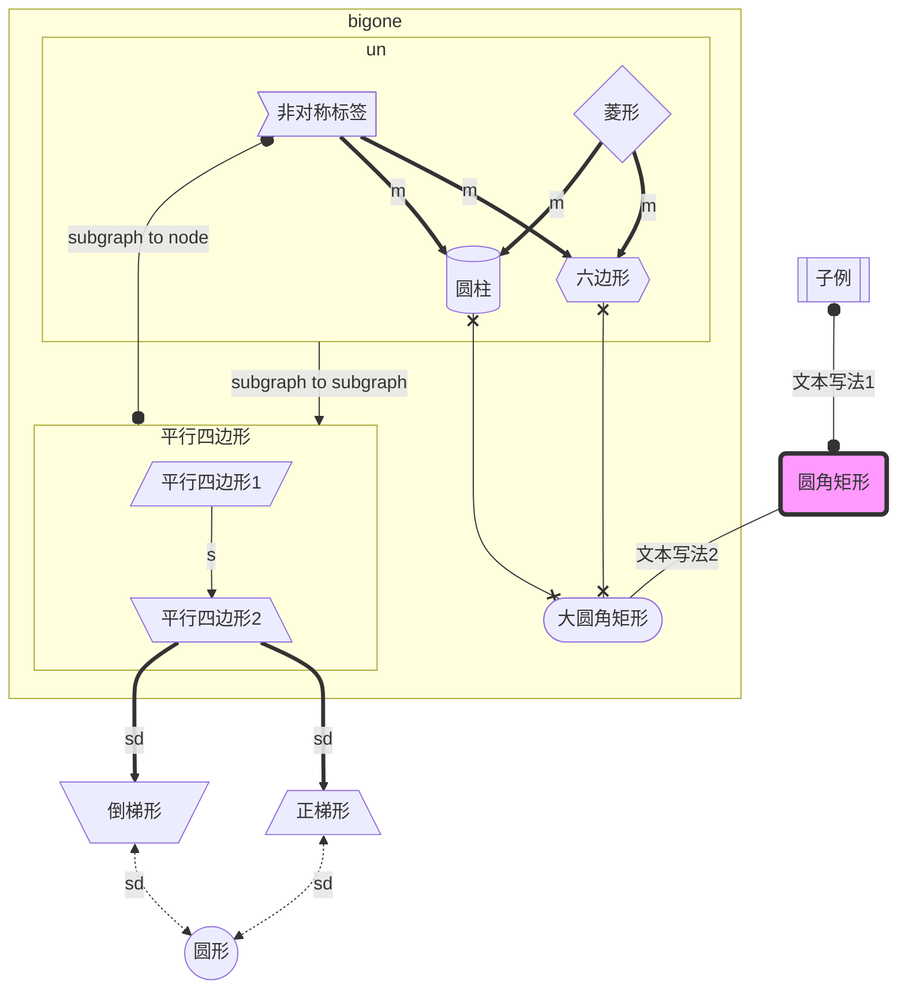

# Markdown使用范例

markdown支持html语法，所以很多样式其实都可以用内置style写法实现

## 文字修饰

`<u><u>`underline this, you can ctrl+u `</u></u>`

~~i want to delete this line~~

**bold this,you can ctrl + b**

*lean this line, you can ctrl + l*

`<span style='color:blue;background:pink;font-size:28px;font-family:幼圆;'>html+内置style包围</span>`效果如下：

<span style='color:blue;background:pink;font-size:28px;font-family:幼圆;'>html+内置style包围</span>

 `<a href="#spch">`跳转：其他特殊字符 `</a>`

用Markdown语法，链接用 `[text](#your-id)`，锚点用span标签包裹，然后为span标签添加id属性。

<center>居中</center>

## 分割线（需要独占一行）

---

## Latex以及特殊字符

可在\$\$...\$\$公式块中编辑公式，或者用\$...\$行内显示。

### 分段、分式函数

$$
c(u)=
\begin{cases} 
\sqrt{\frac{1}{N}\cdot c^2}，u=0 \\ 
\sqrt\frac{2}{N}，u\neq0
\end{cases}
$$

### 矩阵

$$
M=
\begin{bmatrix}
x_{11} & x_{12}  & \cdots   & x_{1m}   \\
x_{21} & x_{22}  & \cdots   & x_{2m}  \\
\vdots & \vdots  & \ddots   & \vdots  \\
x_{n1} & x_{n2}  & \cdots\  & x_{nm}  \\
\end{bmatrix}
$$

### 分栏

$$
\begin{aligned}
f_Y(y) & = f_X[h(y)]|h'(y)| \\[2ex]
& = f_X[h(y)]h'(y) \\[2ex]
& = \frac{1}{\theta}e^{-\frac{x}{\theta}}[\frac{dx}{dy}(-\frac{\theta}{ln(1-y)})] \\[2ex]
& = \frac{1}{\theta}e^{-\frac{-\frac{\theta}{ln(1-y)}}{\theta}}\frac{\theta}{1-y} \\[2ex]
& = \frac{1}{\theta}e^{ln(1-y)}\frac{\theta}{1-y} \\[2ex]
& = \frac{1-y}{\theta}\frac{\theta}{1-y} \\[2ex]
& = 1
\end{aligned}
$$

### 指数、对数

$$
e^{\log_{e+5}{5+e^2}}
$$

### 极限、求和、累积

$$
\lim_{n\rightarrow+\infty}\int_{-\infin}^{+\infin}{f(x)}=\frac{\sqrt{13}} {2\cdot3^x}
\\
\sum_{n=1}^{100}{a_n}
\\
\prod_{n=1}^{99}{x_n}
$$

### 向量

$$
3\vec{a}
$$

### 竖式计算

$$
this\ is\  
\begin{array}{r}
1001\ 0101B\\
+0100\ 1010B\\
\hline
1101\ 1111B
\end{array}
\\
\begin{align}
dfd
\\
dfdf
\\
dfdf
\end{align}
$$

`\ce{}`可以让括号内紧接着字母的数字自动变下标，一些符号自动变上标(由于渲染问题，可能无法正常显示)

$$
\ce{H2O,H,Ca^2+}
$$

### 希腊字母

| 大写       | Markdown | 小写            | Markdown    |
| ---------- | -------- | --------------- | ----------- |
| A          | A        | α $\alpha$      | \alpha      |
| B          | B        | β $\beta$       | \beta       |
| $\Gamma$   | \Gamma   | γ $\gamma$      | \gamma      |
| $\Delta$   | \Delta   | δ $\delta$      | \delta      |
| E          | E        | ϵ $\epsilon$    | \epsilon    |
|            |          | ε $\varepsilon$ | \varepsilon |
| Z          | Z        | ζ $\zeta$       | \zeta       |
| H          | H        | η $\eta$        | \eta        |
| $\Theta$   | \Theta   | θ $\theta$      | \theta      |
| I          | I        | ι $\iota$       | \iota       |
| K          | K        | κ $\kappa$      | \kappa      |
| $\Lambda$  | \Lambda  | λ $\lambda$     | \lambda     |
| M          | M        | μ $\mu$         | \mu         |
| N          | N        | ν $\nu$         | \nu         |
| $\Xi$      | \Xi      | ξ $\xi$         | \xi         |
| O          | O        | ο $\omicron$    | \omicron    |
| $\Pi$      | \Pi      | π $\pi$         | \pi         |
| $P$        | P        | ρ $\rho$        | \rho        |
| $\Sigma$   | \Sigma   | σ $\sigma$      | \sigma      |
| $T$        | T        | τ $\tau$        | \tau        |
| $\Upsilon$ | \Upsilon | υ $\upsilon$    | \upsilon    |
| $\Phi$     | \Phi     | ϕ $\phi$        | \phi        |
|            |          | φ $\varphi$     | \varphi     |
| $X$        | X        | χ $\chi$        | \chi        |
| $\Psi$     | \Psi     | ψ $\psi$        | \psi        |
| $\Omega$   | \Omega   | ω $\omega$      | \omega      |
$
### **运算符**


| 运算符           | latex            | 运算符             | latex              |
| ---------------- | ---------------- | ------------------ | ------------------ |
| $\pm$            | `\pm`            | $\mp$              | `\mp`              |
| $\times$         | `\times`         | $\cdot$            | `\cdot`            |
| $\div$           | `\div`           |                    |                    |
| $\neq$           | `\neq`           | $\equiv$           | `\equiv`           |
| $\leq$           | `\leq`           | $\geq$             | `\geq`             |
| $\ll$            | `\ll`            | $\gg$              | `\gg`              |
| $\sim$           | `\sim`           | $\cong$            | `\cong`            |
| $\subset$        | `\subset`        | $\subseteq$        | `\subseteq`        |
| $\supset$        | `\supset`        | $\supseteq$        | `\supseteq`        |
| $\in$            | `\in`            | $\ni$              | `\ni`              |
| $\notin$         | `\notin`         |                    |                    |
| $\cap$           | `\cap`           | $\cup$             | `\cup`             |
| $\vee$           | `\vee`           | $\wedge$           | `\wedge`           |
| $\circ$          | `\circ`          | $\oplus$           | `\oplus`           |
| $\otimes$        | `\otimes`        | $\odot$            | `\odot`            |
| $\bigtriangleup$ | `\bigtriangleup` | $\bigtriangledown$ | `\bigtriangledown` |
| $\perp$          | `\perp`          |                    |                    |
| $\sum$           | `\sum`           | $\prod$            | `\prod`            |
| $\int$           | `\int`           | $\oint$            | `\oint`            |
| $\propto$        | `\propto`        |                    |                    |
| $\mid$           | `\mid`           |                    |                    |


### <span id="spch">其它特殊字符</span>

| 符号         | Markdown     |
| ------------ | ------------ |
| $\forall$    | `\forall`    |
| $\exists$    | `\exists`    |
| $\because$   | `\because`   |
| $\therefore$ | `\therefore` |
| $\angle$     | `\angle`     |
| $\bot$       | `\bot`       |
| $\nabla$     | `\nabla`     |
| $\infty$     | `\infty`     |
| $\emptyset$  | `\emptyset`  |
| $\mathbb{R}$ | `\mathbb{R}` |
| $\mathbb{z}$ | `\mathbb{z}` |

### 单字符音标符号

$$
\bar{x}
\acute{\eta}
\check{\alpha}
\grave{\eta}
\breve{a}
\ddot{y}
\dot{x}
\hat{\alpha}
\tilde{\iota}
$$

## flow

一种简单的流程图语法。这里介绍一种先“定义/声明“，后”连接“的代码组织形式。

```flow
st=>start: Start
i=>inputoutput: 输入年份n
cond1=>condition: n能否被4整除？
cond2=>condition: n能否被100整除？
cond3=>condition: n能否被400整除？
o1=>inputoutput: 输出非闰年
o2=>inputoutput: 输出非闰年
o3=>inputoutput: 输出闰年
o4=>inputoutput: 输出闰年
e=>end

st->i->cond1
cond1(no)->o1->e
cond1(yes)->cond2
cond2(no)->o3->e
cond2(yes)->cond3
cond3(yes)->o2->e
cond3(no)->o4->e
```

```flow
st=>start: Start
i=>inputoutput: 输入年份n
cond1=>condition: n能否被4整除？
cond2=>condition: n能否被100整除？
cond3=>condition: n能否被400整除？
o1=>inputoutput: 输出非闰年
o2=>inputoutput: 输出非闰年
o3=>inputoutput: 输出闰年
o4=>inputoutput: 输出闰年
e=>end

st->i->cond1
cond1(no)->o1->e
cond1(yes)->cond2
cond2(no)->o3->e
cond2(yes)->cond3
cond3(yes)->o2->e
cond3(no)->o4->e
```


## mermaid

### flowchart

看着和flow差不多，都是方形（或者其他形状）节点相互连线

#### 定义布局方向

- TB - top to bottom
- TD - top-down/ same as top to bottom
- BT - bottom to top
- RL - right to left
- LR - left to right

#### 节点形状以及连接



```
flowchart TB
n3[[子例]]o--o|文本写法1|n1(圆角矩形)--文本写法2---n2([大圆角矩形])
subgraph global [bigone]
subgraph u [un]
n6>非对称标签] & n7{菱形} ==>|m| n8{{六边形}} & n4[(圆柱)] 
end
n8{{六边形}} & n4[(圆柱)]x---x n2([大圆角矩形])
subgraph p [平行四边形]
n9[/平行四边形1/] -->|s| n10[\平行四边形2\]
end
end
u-->|subgraph to  subgraph|p o---o|subgraph to node| n6>非对称标签]
n10[\平行四边形2\] ==>|sd|n11[/正梯形\] & n12[\倒梯形/]<-.->|sd|n5((圆形)) 
%%点击圆角矩形，打开链接
click n2 "https://www.baidu.com" _blank
%%目前Typora里只能设置圆角矩形的样式
style n1 fill:#f9f,stroke:#333,stroke-width:4px
```

### Sequence diagram

### Class Diagram

## 参考

[Markdown语法](`https://www.jianshu.com/p/191d1e21f7ed`)

[颜色表](https://blog.csdn.net/jinggod/article/details/78241901?utm_medium=distribute.pc_relevant.none-task-blog-BlogCommendFromMachineLearnPai2-5.channel_param&depth_1-utm_source=distribute.pc_relevant.none-task-blog-BlogCommendFromMachineLearnPai2-5.channel_param)

[更多公式用法](https://blog.csdn.net/Katherine_hsr/article/details/79179622)

[更多公式&amp;符号](https://www.cnblogs.com/nowgood/p/latexstart.html)

[特殊符号](`https://blog.csdn.net/qq_35896136/article/details/104975932`)

[Markdown绘制流程图的方法 - JackPeng博客 (yuanfentiank789.github.io)](https://yuanfentiank789.github.io/2017/04/12/flowchart/)

[mermaid Doc](https://mermaid-js.github.io/mermaid/#/)
