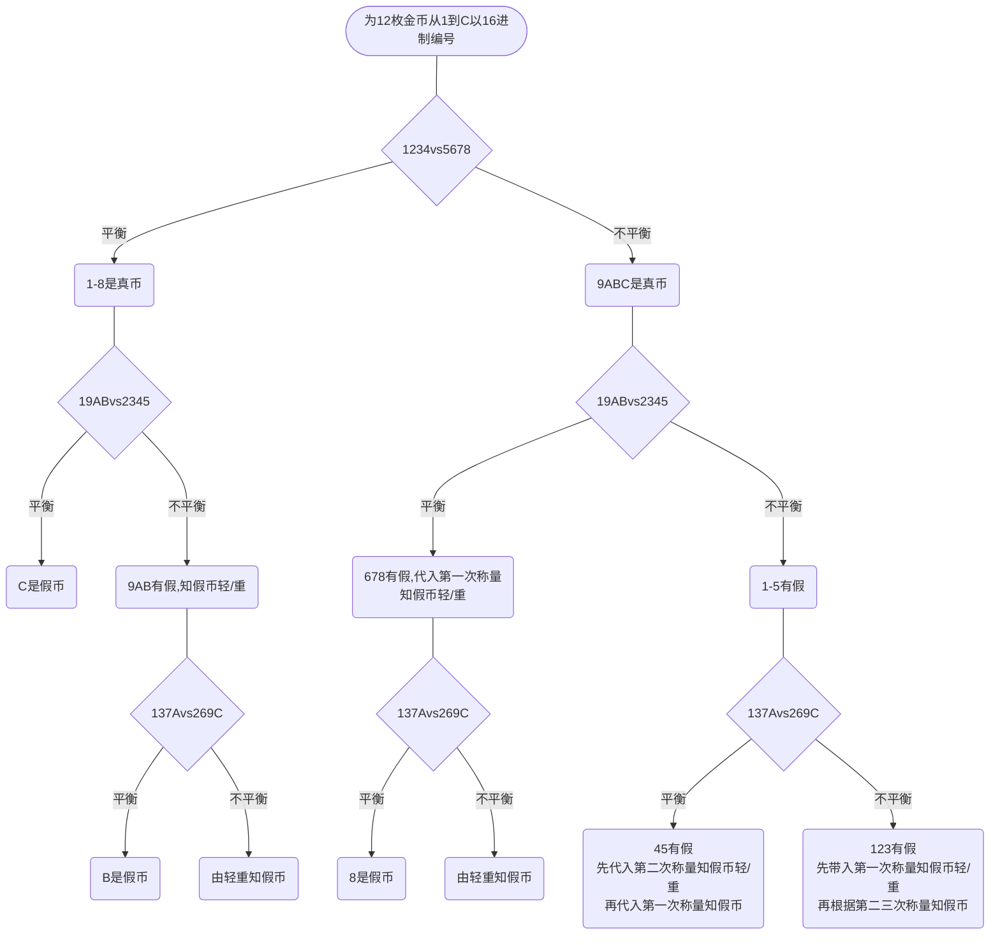

# 问题引入

## 题目

现有12枚外观一致的金币，其中有一枚假币。试问能否利用<u>无砝码天平</u>只称量<u>三次</u>就找到这枚假币？（<u>注：真币假币孰轻孰重未知</u>，天平左右轻重信息可知。）

>   原题
>
>   12球里有一个坏的，轻重未知，请问，最少称几次，能把它挑出来且知道轻重。

## 题解

首先声明：**解法不唯一**！主要是为解题思想提供一个实例，所以按以下编号称量便于理解。

将12枚金币分别编号为 1、2、3、4、5、6、7、8、9、A、B、C 。

因为只有一枚假币，且假币重量和真币不一样，所以如果天平平衡，则两边一定都是真币；如果不平衡，则假币一定在其中一边，且另一边都是真币。

以下称量结果以平衡和不平衡两种情况作为分支，有些情况可以直接下结论，但大部分情况还需根据每次称量结果左沉右沉来判断。

从左到右，最右边一条支线相对难想一点。三次称量首先可得假币存在与1、2、3中。此时先带入第一次称量知假币轻/重。以假币偏重为例，第一次称量结果应当左沉。根据第二次称量结果，若是左沉，则说明1就是假币；如若右沉，则假币在2、3之间，还需根据第三次称量结果判断哪个是假币。假币偏轻也是同理，此不再赘述。

# 参考

知乎高赞回答：[十二个乒乓球特征相同，其中只有一个重量异常，如何用一部没有砝码的天平称三次，将重量异常的球找出来? - 知乎 (zhihu.com)](https://www.zhihu.com/question/33250659)
