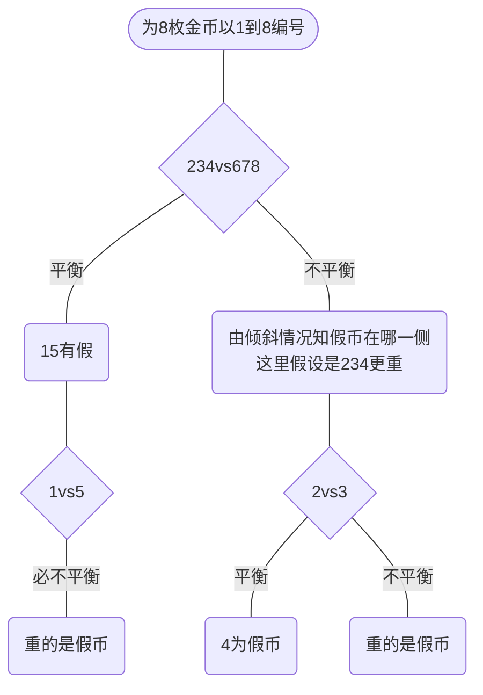

# 问题引入

## 题目

现在有

现有12枚外观一致的金币，其中有一枚假币。试问能否利用<u>无砝码天平</u>只称量<u>三次</u>就找到这枚假币？（<u>注：真币假币孰轻孰重未知</u>，天平左右轻重信息可知。）

>   原题
>
>   12球里有一个坏的，轻重未知，请问，最少称几次，能把它挑出来且知道轻重。

## 简化题目

### 8中1重

在解决12枚金币之前，我们先来看看“8枚金币中有一枚重假币”是怎么解决。看完之后，再看12枚金币，可能会有所帮助。

### 12中1重

现在，将简化题目再升级一下，变成12枚金币，但仍然已知其中有一枚重假币。解题思路就是将12枚分为甲乙丙三组，每组4枚。不妨令甲乙两组比较。若平衡，则丙组有假，至多两次称量即可锁定假币；若不平衡，则变为上面的8金币问题。

## 原题解

不知在看过简化题目后，是否对你有所启发。其实就是确定真币，但下一次称量时，真币不会全放在一侧，避免信息冗余。

首先声明：**解法不唯一**！主要是为解题思想提供一个实例，所以按以下编号称量便于理解。

将12枚金币以16进制分别编号为 1、2、3、4、5、6、7、8、9、A、B、C 。

因为只有一枚假币，且假币重量和真币不一样，所以如果天平平衡，则两边一定都是真币；如果不平衡，则假币一定在其中一边，且另一边都是真币。但仅看本次称量，无法得知哪一侧为真，哪一侧为假（因为假币轻重未知）。因此需要记录前几次称量的具体结果。

以下称量结果以平衡和不平衡两种情况作为分支，有些情况可以直接下结论，但大部分情况还需根据每次称量结果左沉右沉来判断。

从左到右，最右边一条支线相对难想一点。三次称量首先可得假币存在与1、2、3中。此时先带入第一次称量知假币轻/重。以假币偏重为例，第一次称量结果应当左沉。根据第二次称量结果，若是左沉，则说明1就是假币；如若右沉，则假币在2、3之间，还需根据第三次称量结果判断哪个是假币。假币偏轻也是同理，此不再赘述。

# 参考

知乎高赞回答：[十二个乒乓球特征相同，其中只有一个重量异常，如何用一部没有砝码的天平称三次，将重量异常的球找出来? - 知乎 (zhihu.com)](https://www.zhihu.com/question/33250659)
