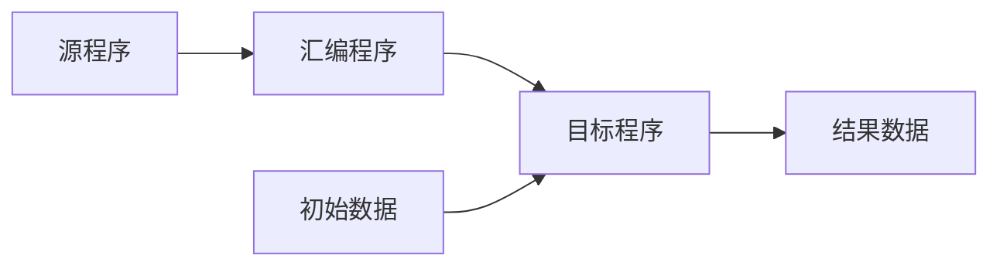
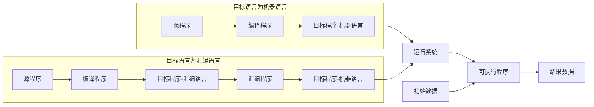
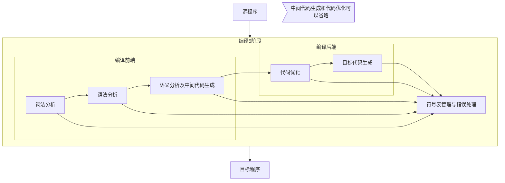

[TOC]

# 引论

## 程序设计语言的翻译机制

用汇编语言或高级语言编写的程序翻译成机器语言才能被计算机识别。完成这一过程的程序称为**翻译程序**。

翻译程序有**汇编程序**、**编译程序**和**解释程序**。

汇编程序和编译程序的翻译机制称为**编译机制**

解释程序的翻译机制称为**解释机制**

源语言：编写源程序的语言

目标语言：编写目标程序的语言

### 汇编程序

| 源语言   | 目标语言 |
| -------- | -------- |
| 汇编语言 | 机器语言 |

汇编程序一般对源程序进行两遍扫描。第一遍进行存储分配，构造各种表格给第二遍扫描使用。第二遍用机器操作码代替源程序中的符号。

### 编译程序

编译程序也叫编译器

| 源语言   | 目标语言           |
| -------- | ------------------ |
| 高级语言 | 汇编语言或低级语言 |

高级语言编写的源程序在机器上的执行过程可分为两个阶段

1.  编译阶段：将源程序翻译成等价的目标程序
2.  运行阶段：执行目标程序，获得结果

现代编译器只负责**编译阶段**，**运行阶段**由**操作系统**完成。目标程序加上运行系统（如服务子程序、动态分配程序、装配程序等）输出结果。

### 解释程序

边解释边执行源程序本身，下一条语句的执行依赖于上一条语句的执行结果，最终输出数据。

解释程序适合于会话型语言。

-   优点：易于为用户提供调试功能，对源程序的语法分析和出错处理处理很及时
-   缺点：执行速度慢，运行效率低

## 编译程序概述

### 词法分析

主要任务：**识别有独立意义的单词**。

进行词法分析的程序叫**词法分析器**或词法扫描器，根据词法规则识别出**最小的语法单位**，即**单词（Token）**，如关键字、标识符、运算符。

识别出单词后，转换为长度统一、格式规范的**内部编码**。内部编码由两部分：一、**类别编码**，区别单词种类；二、**单词的值**，即单词本身的编码。

### 语法分析

主要任务：根据语法规则，从单词流中**识别语法成分**，如（表达式、说明、语句、过程和函数）并检查语法成分是否符合语法结构。

通常将语法分析的结果表示为**语法树**。

进行语法分析的程序被称为**语法分析器**

### 语义分析及中间代码生成

语义：语言的各种语法成分的具体含义。

主要任务：根据语法规则，**分析**已经识别出来的**语法成分的含义**。与语法分析密切相关。通常语法分析器在分析语法成分的同时会进行语义分析，这种方式被称为语法制导翻译。

在语义分析时，语法分析器会进行相应检查。

**语义分析是整个编译程序中最有实质意义的翻译任务**，语法成分经过语义分析被翻译成**中间代码**。

>   中间代码主要是为了便于代码优化和目标代码的移植。目前常见的中间语言形式有三元式、四元式、逆波兰表示等。
>
>   中间代码至少应有两个性质：容易产生和容易翻译成目标语言。例如 Java 字节码、MSIL

### 代码优化

主要任务：**对中间代码进行等价的加工处理**。

[^优化]: 优化的是中间代码

**空间复杂度**和**时间复杂度**是衡量目标代码质量的两大指标。

### 目标代码生成

主要任务：把经过优化的中间代码变成目标代码（机器语言或汇编语言）

### 编译前端和编译后端

词法分析、语法分析、语义分析及中间代码生成，这些与源语言相关的部分被称为**编译前端**

代码优化、目标代码生成，这些与目标语言相关的部分被称为**编译后端**

编译分前后端不仅利于代码优化，还有利于目标代码的生成和移植。

-   可以给同一个编译前端配不同的编译后端，利于代码移植。比如Java就有Java中间码
-   也可以给不同的编译前端配同一个编译后端，源代码兼容性更好。比如GCC。GCC的编译前端是多种语言的不同分析器，经过前端编译生成**抽象语法树（AST，Abstract Syntax Tree）**形式的中间代码；GCC的编译后端以此生成目标代码

由于整个编译过程中会存在各种问题，所以**编译的各个阶段**都涉及**符号表管理**和**错误处理**。

### 符号表管理

符号表管理也被称为表格管理。主要功能：按照编译需求，生成不同用途的符号表（常数表、名字特征表、循环层次表等等），并提供合适的方式查询、修改、维护表格。完成造表并对表格增删改查的程序叫**符号表管理程序**

### 错误处理

主要功能：发现错误、错误局部化（将错误的影响限制在尽可能小的范围内）、续编译（发现错误后还能继续完成剩余部分的分析处理）

不同阶段的不同错误：

1.  词法分析：拼写错误
2.  语法分析：语法错误
3.  语义分析：类型不匹配、参数不匹配

## 编译程序的分遍

编译程序的5个阶段对源程序或等价源程序的扫描次数不定，一次或多次都有可能。

对源程序或等价源程序进行相关的加工处理工作，称为**遍（Pass）**

编译程序有单遍（扫描一次即生成目标代码），也有多遍（每遍只完成编译程序的一部分或几部分工作）

决定编译程序分遍数目的因素：

-   计算机存储容量大小
-   编译程序功能的强弱
-   源语言的繁简
-   目标程序的优化程度
-   设计和实现编译程序时所用的工具的先进性
-   参加人员的数量和素质
